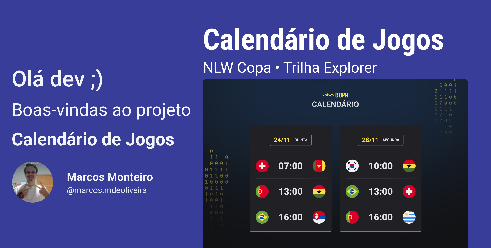

<h1 align="center">Calendario da compa</h1>

 Esse projeto foi feito em um evento gratuito, promovido pela Rocketseat

    <a href="#_tecnologia">Tecnologias</a>&nbsp;&nbsp;&nbsp;|&nbsp;&nbsp;&nbsp;
    <a href="">Projeto</a>&nbsp;&nbsp;&nbsp;|&nbsp;&nbsp;&nbsp;
    <a href="">Layout</a>&nbsp;&nbsp;&nbsp;|&nbsp;&nbsp;&nbsp;
    <a href="">Licença</a>

 

    

 

    

## Tecnologia

Foi utilizado nesse projeto as seguintes tecnologias:

- HTML e CSS
- JavaScript
- Git e Github

---

## Projeto

O projeto é uma pagina que mostre os jogos da copa do mundo de 2022

---

## Layout

Voce pode visualizar e layout desse projeto através [DESSE LINK](https://www.figma.com/file/TaZXY3mO3IjhESbh6zGVZq/Calend%C3%A1rio-de-Jogos-(Community)?node-id=0%3A1). É necessario ter conta no [Figma](https://figma.com) para acessá-lo.

---

## :memo: Licença

Esse projeto está sob a licença MIT

---
